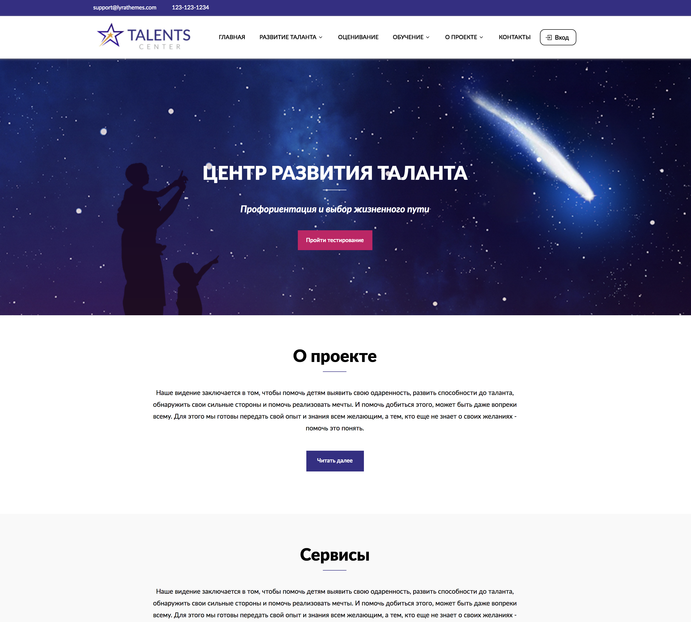

# Project overview
Front-end side of website for talents project. The markup is implemented with the help of gulp, using a sass preprocessor.

## How to install application files
Make sure you've installed node.js https://nodejs.org/ so your computer is able to undertsand 'npm' command.
Clone the repository to your computer. Cd into repository. Run 'npm install' command. By default, npm install will install all modules listed as dependencies in package.json. 
Run gulp watch. It will open website at http://localhost:3000/